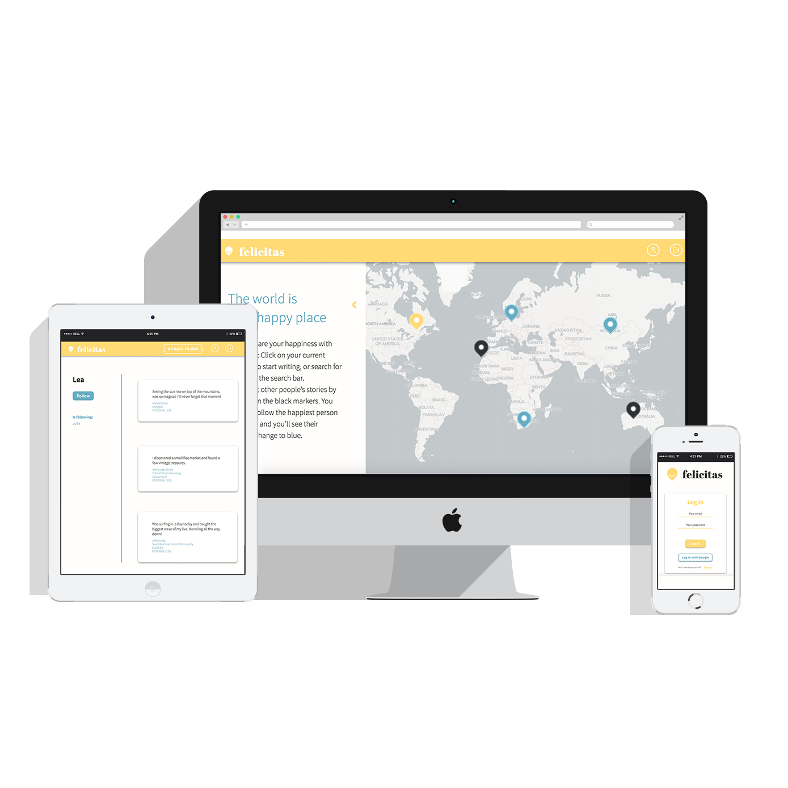

# Felicitas

A social network to share a positive story setting markers on a map, making the world a happy place and connecting people.
Limited timeframe of 5 days to complete this project using Express.js as framework and the OpenStreetMap-API to fetch the location data. Protected by log-in and Google sign-up.

**Stack used:** Express.js, Passport.js, MongoDB, Node.js, OSM-API, Html, Sass



### Installation:

```sh
$ git clone
$ npm install
$ npm run dev
Go to `http://localhost:3000`
```
